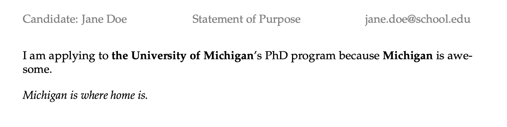
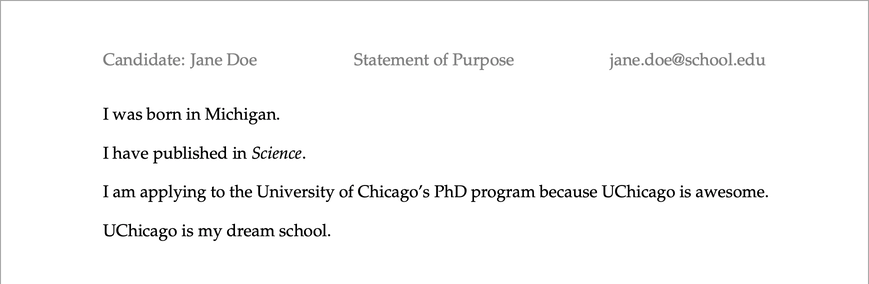

# Example: PhD Applications

I'm applying to PhD programs. The main body of my personal statement is the same for each program, except for places where I mention the name of the program. I also have an end paragraph tailored to each program. 

My desired results:

University of Michigan|University of Chicago
:---:|:---:|
|

## Templates

My `template.md` looks like this:

```
!INCLUDE asis "template.md"
```

The template makes reference to my end paragraphs customized for each program, which I place under `custom/`.

```
custom/
    Michigan_last.md
    UChicago_last.md
```

The one for Michigan, `Michigan_last.md`, looks like this:

```markdown
!INCLUDE asis "custom/Michigan_last.md"
```

I also have a separate `header.md` that contains a [YAML metadata block](https://pandoc.org/MANUAL.html#extension-yaml_metadata_block), which tells pandoc how to style my PDF. It contains LaTeX commands that control the styling of the PDF, which pandoc will include in the header of an intermediary LaTeX file. 

```yaml
!INCLUDE asis "header.md"
```


## Variables in YAML

For each school I'm applying to, I create a YAML file under `custom`. 

```
custom/
    Michigan.yaml
    UChicago.yaml
```

Each specifies one set of values for the variables that occurs in my templates. The one for Michigan:

```yaml
!INCLUDE asis "custom/Michigan.yaml"
```

## Conversion

I run the following command. 

```shell
crisscross process header.md template.md
```

By default, CrissCross will take all the YAML files under `custom/`. For each file/set of variables, it will first generate a composite Markdown file, and then through pandoc, a PDF, wherein placeholder expressions like `{{school}}` are replaced as specified. 

The output files will be placed under `docs/` by default, each named after its corresponding YAML file. 

```
docs/
    Michigan.md
    Michigan.pdf
    UChicago.md
    Uchicago.pdf
```


In this example, we've only used the default settings of the `process` command. CrissCross is much more customizable than that! Check out the [main documentation](../../) for more details. 